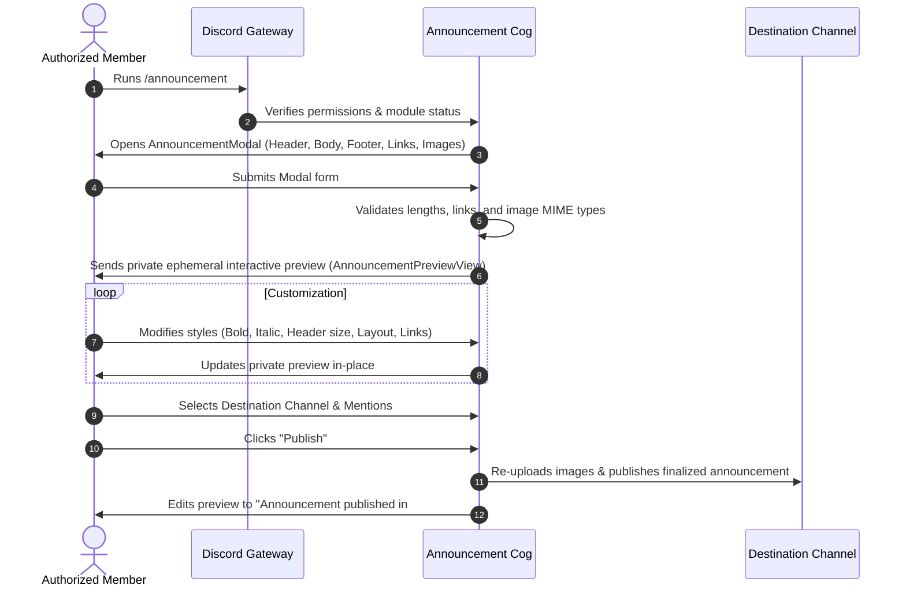

# Announcement Cog (`cogs/announcement.py`)

## 1. Overview & Purpose
The `Announcement` cog ([cogs/announcement.py](file:///d:/Projects/DiscordBot/cogs/announcement.py)) is an advanced announcement management system for Discord servers. It features an interactive popup modal composer, private ephemeral preview workflow, real-time styling controls, multi-image upload handling, link button converters, and granular role-based access control (RBAC).

---

## 2. Connected Files & Architecture

| Connected File | Relationship & Usage |
| :--- | :--- |
| [bot.py](file:///d:/Projects/DiscordBot/bot.py) | Loaded dynamically into bot runtime during startup. |
| [config.py](file:///d:/Projects/DiscordBot/config.py) | Accesses `Config.is_module_enabled(guild_id, "announcement")`, `Config.get_announcement_roles(guild_id)`, `Config.set_announcement_roles(...)`, and `Config.check_member_cog_permission(...)`. |
| [cogs/settings.py](file:///d:/Projects/DiscordBot/cogs/settings.py) | Displays configured announcement roles and module status in `!settings`. |
| [dashboard/app.py](file:///d:/Projects/DiscordBot/dashboard/app.py) | Mirrors announcement functionality on the web dashboard (`/api/guild/<id>/announcement/send`) with color tagging (`[color=...]`), author profile resolution, and webhook/channel publishing. |

---

## 3. Data Structures & Helper Logic

### `AnnouncementDraft`
The in-memory data class representing an announcement before final broadcast:
- `author_id` & `author_name`: User metadata.
- `header`, `body`, `footer`: Core text blocks.
- `images`: List of `discord.Attachment` objects (up to 10).
- `links`: List of `AnnouncementLink(url, label)`.
- `link_style`: Display mode (`auto`, `card`, `button`, `image`, `thumbnail`).
- `selected_section`: Active field targeted for markdown styling (`header`, `body`, `footer`).
- `styles`: Mapping of sections to applied styles (`bold`, `italic`, `underline`).
- `heading_level`: Markdown header size (`#`, `##`, `###`).
- `image_placement`: Visual layout (`large` image or `thumbnail`).
- `destination`: Target `discord.TextChannel`.
- `notify_roles`: Explicit `discord.Role` targets.
- `notify_users`: Explicit `discord.User` / `discord.Member` targets.

### Text & Media Parsers:
- `_styled(text, styles)`: Applies Discord markdown wrappers in stable order (`**`, `*`, `__`).
- `_parse_links(raw_links)`: Parses format `Label | https://example.com` or plain URLs. Validates HTTP/HTTPS scheme and character limits.
- `_youtube_preview_urls(text)`: Extracts YouTube URLs from text to enable native Discord embed previews alongside custom embeds.
- `_roles_mentioned_in_text(guild, texts)`: Automatically detects literal `@role-name` text and translates to pingable role objects.
- `_users_mentioned_in_text(guild, texts)`: Matches inline `@username` or `<@id>` mentions to server members.
- `_broadcast_mentions_in_text(texts)`: Identifies `@everyone` and `@here` mentions.

---

## 4. User Interaction Workflow

---

## 5. Slash Commands Reference

### `/announcement`
- **Permission**: Allowed Announcement Roles, Server Administrators, or Manage Server.
- **Scope**: Guild only (`@app_commands.guild_only()`).
- **Functionality**: Launches the modal composer for drafting announcements.

### `/announcement_roles add <role>`
- **Permission**: Server Administrators (`default_permissions(administrator=True)`).
- **Functionality**: Adds a Discord server role to the allowed creator whitelist in `data/settings.db`.

### `/announcement_roles remove <role>`
- **Permission**: Server Administrators.
- **Functionality**: Removes a role from the allowed creator whitelist.

### `/announcement_roles list`
- **Permission**: Server Administrators.
- **Functionality**: Displays the list of currently authorized roles. If no server roles are stored, displays fallback roles from `.env` (`ANNOUNCEMENT_ALLOWED_ROLE_IDS`).

---

## 6. Security & Edge Case Handling
1. **Attachment Expiration**: Discord attachment URLs generated during modal submission expire quickly. The cog converts attachments to fresh file byte streams via `image.to_file()` upon final broadcast, preventing broken images.
2. **Embed Size Restrictions**: Strictly verifies Discord embed limits before displaying the preview:
   - Header <= 256 characters.
   - Body <= 3000 characters.
   - Embed description <= 4096 characters.
   - Total embed text across all fields <= 6000 characters.
3. **Channel Permission Verification**: Catches `discord.Forbidden` gracefully if the bot lacks `Send Messages`, `Embed Links`, or `Attach Files` in the destination channel.
