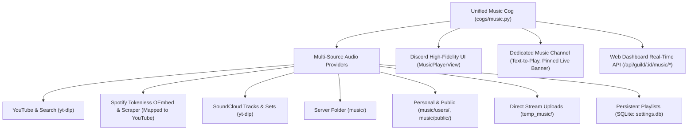

# Music System Cog (`cogs/music.py`)

## 1. Overview & Purpose
The `Music` cog ([cogs/music.py](file:///d:/Projects/DiscordBot/cogs/music.py)) is a unified, high-performance audio engine for Discord. It provides multi-source audio streaming (YouTube, tokenless Spotify, SoundCloud, server-local audio, personal & public user libraries, direct uploads), persistent SQLite playlists, a dedicated interactive music channel with text-to-play, and seamless Web Dashboard remote control.

---

## 2. Architecture & Legacy Consolidation

> [!NOTE]
> In earlier bot revisions, music functionality was split across three separate extensions: `cogs/directstream.py`, `cogs/localmusic.py`, and `cogs/usermusic.py`.
> In [bot.py](file:///d:/Projects/DiscordBot/bot.py), these legacy cogs are explicitly skipped on startup (`legacy_music_cogs = {"directstream", "localmusic", "usermusic"}`) in favor of the unified [cogs/music.py](file:///d:/Projects/DiscordBot/cogs/music.py).



| Component | Path / Reference | Purpose |
| :--- | :--- | :--- |
| **Unified Cog** | [cogs/music.py](file:///d:/Projects/DiscordBot/cogs/music.py) | Active production music cog loaded by the bot. |
| **Database & Config** | [config.py](file:///d:/Projects/DiscordBot/config.py) | Persistent storage for server playlists & dedicated channel settings in `data/settings.db`. |
| **Legacy DirectStream** | [cogs/directstream.py](file:///d:/Projects/DiscordBot/cogs/directstream.py) | Preserved historical implementation of temporary upload streaming. |
| **Legacy LocalMusic** | [cogs/localmusic.py](file:///d:/Projects/DiscordBot/cogs/localmusic.py) | Preserved historical implementation of server-local folder playback. |
| **Legacy UserMusic** | [cogs/usermusic.py](file:///d:/Projects/DiscordBot/cogs/usermusic.py) | Preserved historical implementation of user libraries. |
| **Web Dashboard** | [dashboard/app.py](file:///d:/Projects/DiscordBot/dashboard/app.py) | Connects via REST endpoints to query state, quick-play, and trigger remote playback controls. |

---

## 3. Storage & Directory Layout

The music system manages three physical directory structures in the project root:

1. **`music/`**: Server-wide local audio files playable via `/playlocal`.
2. **`music/public/`**: Community-shared audio library playable via `/publicmusic`.
3. **`music/users/<user_id>/`**: Private personal user collections playable via `/mymusic`.
4. **`temp_music/`**: Temporary direct-stream uploads (automatically purged after 1 hour).
5. **`data/settings.db`**: Persistent SQLite tables for saved playlists (`guild_music_playlists`, `guild_music_playlist_tracks`).

---

## 4. Playback Engine & Voice Architecture

- **Multi-Source Support**:
  - **YouTube**: Direct videos, shorts, and full playlists with flat metadata extraction.
  - **Spotify**: Tokenless extraction of tracks, albums, and playlists via open oEmbed endpoints, resolving audio dynamically via YouTube.
  - **SoundCloud**: Native single track and set extraction via `yt-dlp`.
- **In-Use Protection & Voice Reconnect Engine**:
  - Eliminates the `ClientException: Already connected to a voice channel` bug by inspecting `guild.voice_client` directly and recovering from lingering socket states.
  - **In-Use Protection**: If the bot is actively playing in Voice Channel A with listeners, users in Voice Channel B are prevented from hijacking the session unless force-moved.
  - **Smart Idle Disconnect**: Disconnects cleanly after 3 minutes of inactivity or when the voice channel becomes empty of humans.
- **Audio Decoding**: Powered by `FFmpegPCMAudio` with reconnect flags:
  ```python
  FFMPEG_OPTIONS = {
      'before_options': '-reconnect 1 -reconnect_streamed 1 -reconnect_delay_max 5',
      'options': '-vn'
  }
  ```
- **Dynamic Volume**: Wrapped in `discord.PCMVolumeTransformer` allowing linear volume adjustments from 0% to 200%.
- **Loop Modes**:
  - `off`: Standard linear queue.
  - `single`: Continuously repeats the current track.
  - `queue`: Appends finished tracks to the back of the queue.

---

## 5. In-Discord High-Fidelity Controller (`MusicPlayerView`)

The embedded player provides a visual, console-grade player interface:
- **Timeline & Progress Bar**: Real-time progress bar (`🔘▬▬▬▬▬▬▬▬ 01:23 / 03:45`) and duration indicator.
- **Status & Source Badges**: Displays track source (`🔴 YouTube`, `🟢 Spotify`, `🟠 SoundCloud`, `📁 Local`), status, volume, and requester.
- **Interactive Buttons**:
  - `⏮️ Previous`: Replays the previous track from session history.
  - `⏯️ Play / Pause`: Toggles voice playback.
  - `⏭️ Skip`: Advances to next track in queue.
  - `⏹️ Stop`: Clears queue and terminates playback.
  - `🔀 Shuffle`: Randomly shuffles the upcoming queue.
  - `🔁 Loop`: Cycles through loop modes (`Off` ➔ `Track` ➔ `Queue`).
  - `🔉 Vol -` / `🔊 Vol +`: Adjusts volume in 10% increments.
  - `📜 Queue`: Sends an interactive ephemeral overview of upcoming tracks.
  - `📚 Library`: Quick-reference guide to local, personal, and server playlists.

---

## 6. Dedicated Music Channel (`/musicchannel`)

Servers can configure a dedicated music channel (e.g. `#music-player`) using `/musicchannel setup` or `/musicchannel set <#channel>`:
- **Pinned Interactive Player Banner**: Automatically pins the full-featured music controller embed to the top of the channel. Automatically cleans Discord's default `pins_add` system notifications so the channel stays pristine.
- **Immediate Link & Text Deletion Upon Detection**: When any server member sends a YouTube, Spotify, SoundCloud URL, or song search into the channel, the bot **immediately deletes their message/link upon detection**.
- **Ephemeral Audio Feedback**: If the user is in voice, the track is enqueued, the live pinned banner is updated, and a temporary confirmation message is sent that automatically deletes itself after 4 seconds (`delete_after=4.0`).
- **Always Pinned & Up-to-Date**: On bot startup (`_ensure_dedicated_channel_players`) and during live playback updates (`refresh_all_controllers`), the bot ensures the player embed is present and pinned.

---

## 7. Complete Slash Commands Reference

### Audio Playback & Search:
- `/play <query> [force]`: Stream a YouTube, Spotify, or SoundCloud URL, search keywords, or load a playlist.
- `/search <query>`: Queries YouTube and presents an interactive select dropdown with top 5 matches.
- `/playlocal <filename>`: Play an audio file from the server's local `music/` directory (with autocomplete).
- `/mymusic <song>`: Play a track stored in your personal library (`music/users/<id>/`) (with autocomplete).
- `/publicmusic <song>`: Play a song from the shared public library (`music/public/`) (with autocomplete).
- `/streamupload <file>`: Directly upload and play an audio file (up to 100 MB).

### Dedicated Music Channel:
- `/musicchannel setup`: Automatically creates and pins the live player in `#music-player`.
- `/musicchannel set <channel>`: Sets an existing channel as the dedicated music channel.
- `/musicchannel clear`: Clears the dedicated music channel setting.

### Persistent Server Playlists:
- `/playlist create <name>`: Create a new server playlist stored in SQLite.
- `/playlist add <name> <query>`: Add a track to a playlist (with autocomplete).
- `/playlist play <name>`: Enqueue and play all tracks from a playlist (with autocomplete).
- `/playlist view <name>`: View all tracks in a saved playlist (with autocomplete).
- `/playlist list`: List all saved playlists in the server.
- `/playlist delete <name>`: Delete a playlist (creator or Admin only).

### Playback Management:
- `/previous`: Replay the previous song from history.
- `/skip`: Skip the current song.
- `/pause`: Pause active playback.
- `/resume`: Resume paused playback.
- `/stop`: Stop music and empty the queue.
- `/queue`: View upcoming songs and total duration.
- `/remove <position>`: Remove a specific song index from the queue.
- `/nowplaying`: Display rich metadata with live timeline progress bar.
- `/volume <percent>`: Set volume (0% to 200%).
- `/loop <mode>`: Set loop mode (`off`, `single`, `queue`).
- `/shuffle`: Randomly shuffle queued songs.
- `/clearqueue`: Wipe all queued songs while keeping current song playing.
- `/disconnect`: Safely leave voice channel and reset guild music state.

### Library & File Management:
- `/musiclist`: List files present in the server's music folder.
- `/musicinfo`: View audio directory storage metrics.
- `/musiclibrary <scope>`: Browse personal or public libraries.
- `/musicstats`: Show disk usage and song counts across all libraries.
- `/sharesong <filename>`: Copy a song from personal folder into the public library (with autocomplete).
- `/streamstatus`: Diagnostic status of current playback buffers.
- `/streamhelp`: Help and usage manual for music commands.

---

## 8. Web Dashboard Remote Control API

The music engine exposes direct state and control endpoints to [dashboard/app.py](file:///d:/Projects/DiscordBot/dashboard/app.py):
- `GET /api/guild/<id>/music/state`: Returns `{playing, is_paused, current, elapsed, progress_percent, volume, loop_mode, is_shuffled, voice_channel, listeners_count, queue}`.
- `POST /api/guild/<id>/music/play`: Queue a track or link directly from the web browser (`{"query": "..."}`).
- `POST /api/guild/<id>/music/pause`: Remote pause/resume.
- `POST /api/guild/<id>/music/skip`: Remote skip.
- `POST /api/guild/<id>/music/previous`: Remote previous track.
- `POST /api/guild/<id>/music/stop`: Remote stop.
- `POST /api/guild/<id>/music/shuffle`: Remote shuffle toggle.
- `POST /api/guild/<id>/music/volume`: Remote volume slider update.
- `POST /api/guild/<id>/music/loop`: Remote loop mode switcher.
- `POST /api/guild/<id>/music/remove`: Remove queued item at position (`{"position": ...}`).
- `POST /api/guild/<id>/music/clear`: Clear upcoming queue.
