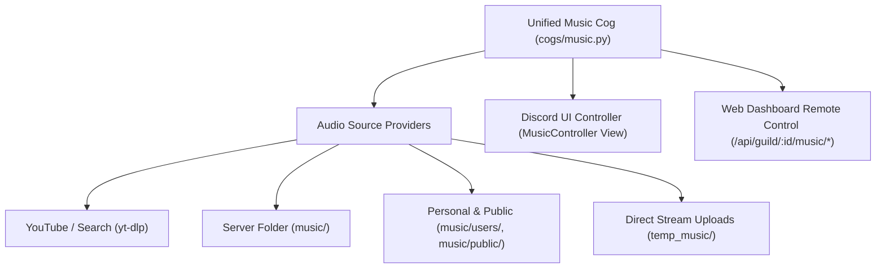

# Music System Cog (`cogs/music.py`)

## 1. Overview & Purpose
The `Music` cog ([cogs/music.py](file:///d:/Projects/DiscordBot/cogs/music.py)) is a unified, high-performance audio engine for Discord. It consolidates YouTube streaming, interactive search, server-local audio playback, personal & public user music directories, and direct file streaming into a single, cohesive module with real-time UI controls and remote web dashboard management.

---

## 2. Architecture & Legacy Consolidation

> [!NOTE]
> In earlier bot revisions, music functionality was split across three separate extensions: `cogs/directstream.py`, `cogs/localmusic.py`, and `cogs/usermusic.py`.
> In [bot.py](file:///d:/Projects/DiscordBot/bot.py), these legacy cogs are explicitly skipped on startup (`legacy_music_cogs = {"directstream", "localmusic", "usermusic"}`) in favor of the unified [cogs/music.py](file:///d:/Projects/DiscordBot/cogs/music.py).



| Component | Path / Reference | Purpose |
| :--- | :--- | :--- |
| **Unified Cog** | [cogs/music.py](file:///d:/Projects/DiscordBot/cogs/music.py) | Active production music cog loaded by the bot. |
| **Legacy DirectStream** | [cogs/directstream.py](file:///d:/Projects/DiscordBot/cogs/directstream.py) | Preserved historical implementation of temporary upload streaming. |
| **Legacy LocalMusic** | [cogs/localmusic.py](file:///d:/Projects/DiscordBot/cogs/localmusic.py) | Preserved historical implementation of server-local folder playback. |
| **Legacy UserMusic** | [cogs/usermusic.py](file:///d:/Projects/DiscordBot/cogs/usermusic.py) | Preserved historical implementation of user libraries. |
| **Web Dashboard** | [dashboard/app.py](file:///d:/Projects/DiscordBot/dashboard/app.py) | Connects via REST endpoints to query state and trigger remote playback controls. |

---

## 3. Storage & Directory Layout

The music system manages three physical directory structures in the project root:

1. **`music/`**: Server-wide local audio files playable via `/playlocal`.
2. **`music/public/`**: Community-shared audio library playable via `/publicmusic`.
3. **`music/users/<user_id>/`**: Private personal user collections playable via `/mymusic`.
4. **`temp_music/`**: Temporary direct-stream uploads (automatically purged after 1 hour).

---

## 4. Playback Engine & Audio Pipeline

- **Stream Extraction**: Uses `yt-dlp` with `extract_flat` heuristics for fast metadata resolution and fallback deep extraction for live streaming.
- **Audio Decoding**: Powered by `FFmpeg` with reconnect optimizations:
  ```python
  FFMPEG_OPTIONS = {
      'before_options': '-reconnect 1 -reconnect_streamed 1 -reconnect_delay_max 5',
      'options': '-vn'
  }
  ```
- **Dynamic Volume**: Wrapped in `discord.PCMVolumeTransformer` allowing linear volume adjustments from 0% to 200% without restarting tracks.
- **Loop Modes**:
  - `off`: Standard linear queue.
  - `single`: Continuously repeats the current track.
  - `queue`: Appends finished tracks to the back of the queue.

---

## 5. In-Discord Interactive Controller (`MusicController`)

Whenever audio starts playing, the cog attaches an interactive Discord UI view:
- **`⏯️ Pause / Resume`**: Toggles voice playback.
- **`⏭️ Skip`**: Advances to next track in queue.
- **`⏹️ Stop`**: Clears queue, terminates playback, and disconnects after idle timeout.
- **`🔁 Loop`**: Cycles through loop modes (`Off` ➔ `Track` ➔ `Queue`).
- **`📜 Queue`**: Displays the active playlist.
- **`🔉 Vol -` / `🔊 Vol +`**: Adjusts volume in 10% increments.

---

## 6. Complete Slash Commands Reference

### Audio Playback & Search:
- `/play <query>`: Stream a YouTube URL, search keywords, or load a YouTube playlist.
- `/search <query>`: Queries YouTube and presents an interactive select dropdown with top 5 matches.
- `/playlocal <filename>`: Play an audio file from the server's local `music/` directory.
- `/mymusic <song>`: Play a track stored in the user's personal library (`music/users/<id>/`).
- `/publicmusic <song>`: Play a song from the shared public library (`music/public/`).
- `/streamupload <file>`: Directly upload and play an audio file (up to 100 MB).

### Playback Management:
- `/skip`: Skip the current song.
- `/pause`: Pause active playback.
- `/resume`: Resume paused playback.
- `/stop`: Stop music and empty the queue.
- `/queue`: View upcoming songs and total duration.
- `/remove <position>`: Remove a specific song index from the queue.
- `/nowplaying`: Display rich metadata (title, duration, progress bar, requester) for current track.
- `/volume <percent>`: Set volume (0% to 200%).
- `/loop <mode>`: Set loop mode (`off`, `single`, `queue`).
- `/clearqueue`: Wipe all queued songs while keeping current song playing.
- `/disconnect`: Forcibly leave voice channel and reset guild music state.

### Library & File Management:
- `/musiclist`: List files present in the server's music folder.
- `/musicinfo`: View audio directory storage metrics.
- `/musiclibrary <scope>`: Browse personal or public libraries.
- `/musicupload`: Instructions on how to add tracks to your personal library.
- `/musicstats`: Show disk usage and song counts across all libraries.
- `/sharesong <song>`: Copy a song from your personal folder into the public library.
- `/streamstatus`: Diagnostic status of current playback buffers.
- `/streamhelp`: Help and usage manual for music commands.

---

## 7. Web Dashboard Remote Control API
The music engine exposes direct state and control endpoints to [dashboard/app.py](file:///d:/Projects/DiscordBot/dashboard/app.py):
- `GET /api/guild/<id>/music/state`: Returns `{playing, current_track, is_paused, volume, loop_mode, queue}`.
- `POST /api/guild/<id>/music/pause`: Remote pause/resume.
- `POST /api/guild/<id>/music/skip`: Remote skip.
- `POST /api/guild/<id>/music/stop`: Remote stop.
- `POST /api/guild/<id>/music/volume`: Remote volume slider update.
- `POST /api/guild/<id>/music/loop`: Remote loop mode switcher.
