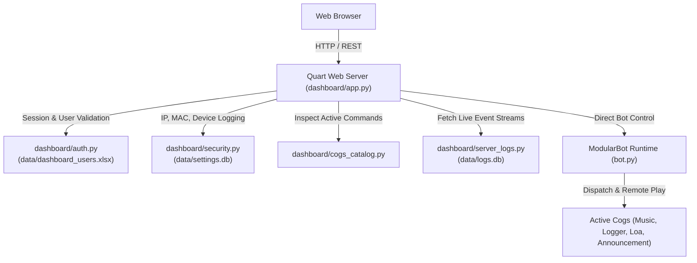

# Web Management Dashboard (`dashboard/`)

## 1. Overview & Purpose
The Web Management Dashboard is an asynchronous, browser-based administration interface for the Discord Bot. Built on **Quart** (the asynchronous Python web framework), it runs concurrently inside the bot's native `asyncio` event loop. It provides an Excel-authenticated control center for managing guild modules, RBAC permissions, live music streaming, announcements, server audit logs, and hardware device security tracking.

---

## 2. Directory Structure & Architecture

```
dashboard/
├── __init__.py
├── app.py                # Quart application factory, routes, and REST APIs
├── auth.py               # Excel-based authentication manager (data/dashboard_users.xlsx)
├── security.py           # Client IP, ARP/MAC resolution, device profiling & audit logging
├── server_logs.py        # Asynchronous provider querying data/logs.db
├── cogs_catalog.py       # Live metadata introspection for bot cogs and slash commands
└── templates/
    ├── base.html         # Responsive layout with modern dark theme and navigation
    ├── login.html        # Authentication page with validation and error badges
    ├── index.html        # Connected Discord servers overview & guild switcher
    └── guild.html        # Comprehensive server control panel (170KB+ single-page dashboard)
```



---

## 3. Authentication & User Management (`dashboard/auth.py`)

Unlike standard bots that rely solely on Discord OAuth2, this dashboard uses a dedicated, off-Discord **Excel user registry** stored at `data/dashboard_users.xlsx`.

### User Attributes:
- **User ID**: Unique login handle (e.g. `admin`, `supervisor`, `ARC_sadman`).
- **Access Key**: Secret authentication key or Discord Snowflake ID.
- **Full Name**: Display name.
- **Role**: `Administrator`, `Moderator`, `Viewer`.
- **Status**: `Active`, `Suspended`.
- **Created At** & **Notes**: Administrative metadata.

### Auto-Initialization:
If `data/dashboard_users.xlsx` is missing, `init_users_sheet()` creates it automatically with formatted headers and default credentials:
- `admin` / `admin-key-2026` (Master Admin)
- `supervisor` / `staff-access-2026` (Team Supervisor)

---

## 4. Hardware Tracking & Security Telemetry (`dashboard/security.py`)

Every interaction on the dashboard is audited with hardware and network telemetry:
1. **Client IP Resolution (`get_client_ip`)**: Resolves client IPs through proxy headers (`CF-Connecting-IP`, `X-Forwarded-For`, `X-Real-IP`, or direct remote address).
2. **Hardware MAC Resolution (`get_client_mac`)**:
   - Loopback connections resolve local hardware MAC via `uuid.getnode()`.
   - Private LAN subnets (`192.168.x.x`, `10.x.x.x`, `172.16-31.x.x`) query the operating system's ARP cache (`arp -a <ip>`).
   - Routed WAN/Internet requests are safely labeled as `Remote (Gateway Routed)`.
3. **Device Signature (`get_device_info`)**: Parses the `User-Agent` to record browser and operating system (e.g., `Chrome on Windows 10/11`).
4. **Audit Log Table (`dashboard_access_logs`)**:
   Stored in `data/settings.db`:
   ```sql
   CREATE TABLE IF NOT EXISTS dashboard_access_logs (
       id INTEGER PRIMARY KEY AUTOINCREMENT,
       timestamp TIMESTAMP DEFAULT CURRENT_TIMESTAMP,
       user_id TEXT NOT NULL,
       user_name TEXT,
       action TEXT NOT NULL,
       ip_address TEXT,
       mac_address TEXT,
       device_info TEXT,
       details TEXT
   );
   ```

---

## 5. Web Routes & API Endpoints (`dashboard/app.py`)

### Page Routes:
| Route | Method | Access | Description |
| :--- | :---: | :---: | :--- |
| `/login` | `GET`, `POST` | Public | Authenticates credentials against Excel sheet and creates session. |
| `/logout` | `GET` | Authenticated | Clears session and logs logout audit event. |
| `/` | `GET` | Authenticated | Displays list of connected Discord guilds with member counts. |
| `/guild/<guild_id>` | `GET` | Authenticated | Main administrative dashboard for a specific Discord server. |

### REST API Endpoints:

#### Server Configuration & Modules:
- `POST /api/guild/<guild_id>/module`: Toggles modules (`music`, `logger`, `loa`, `announcement`).
- `POST /api/guild/<guild_id>/settings/prefix`: Changes the bot's command prefix.
- `POST /api/guild/<guild_id>/log/channel`: Updates designated server audit logging channel.
- `POST /api/guild/<guild_id>/announcement_roles`: Updates permitted announcement creator roles.
- `POST /api/guild/<guild_id>/loa_config`: Updates LOA channels, roles, and timezone offset.
- `POST /api/guild/<guild_id>/settings`: Generic key-value configuration setter.

#### Role-Based Access Control (RBAC):
- `GET /api/guild/<guild_id>/cog_permissions`: Retrieves permission levels (`everyone`, `roles_only`, `admin_only`) and allowed roles for each cog.
- `POST /api/guild/<guild_id>/cog_permissions`: Updates permission level and role assignments for a cog.

#### Live Music Player Remote Control:
- `GET /api/guild/<guild_id>/music/state`: Returns live playback state (active song, duration, volume, pause state, loop mode, queue).
- `POST /api/guild/<guild_id>/music/pause`: Remote pause/resume.
- `POST /api/guild/<guild_id>/music/skip`: Remote track skip.
- `POST /api/guild/<guild_id>/music/stop`: Remote playback stop and queue clear.
- `POST /api/guild/<guild_id>/music/volume`: Remote volume slider adjustment.
- `POST /api/guild/<guild_id>/music/loop`: Cycles loop mode (`off`, `single`, `queue`).

#### Announcement Broadcast & ANSI Parser:
- POST /api/guild/<guild_id>/announcement/send: Publishes announcements to Discord channels with:
  - **Color Highlights**: Converts friendly [color=red]text[/color] tags into Discord's native ANSI syntax (\x1b[1;31mtext\x1b[0m), supporting all standard colors (
ed, green, yellow, lue, pink, cyan, white, gray, orange, purple, iolet, etc.) and arbitrary hex codes via Euclidean RGB distance matching.
  - **Colored Headings (Titles)**: Since Discord embeds render native embed.title in plain white, custom heading colors are rendered via an ANSI title block at the top of the description/body to preserve vibrant title colors in Discord.
  - **Text Justification & Alignment**: Provides [justify] tags and a 📐 Justify Text toggle (	ext-align: justify, 	ext-justify: inter-word) along with decorative divider framing (━━━━━━━━━━━━━━━━━━━━━━━━━━━━) and center alignment ([center]) for professional document presentation.
  - **Author Identity**: Accurately resolves author names (custom name, User ID like ARC_sadman, or Discord member nickname) and avatar.

#### Audit & Security Logs:
- `GET /api/guild/<guild_id>/server_logs`: Queries `data/logs.db` for real-time Discord audit events with action filters and pagination.
- `GET /api/security_logs`: Queries `data/settings.db` for dashboard login attempts and configuration changes.
- `GET /api/cogs_catalog`: Returns live metadata, parameters, and permission levels for all loaded cogs and slash commands.

---

## 6. HTML Templates Overview

- **`login.html`**:
  Modern dark-mode glassmorphic authentication view. Features animated glowing cards, real-time input validation, show/hide password toggle, and error alert banners.

- **`base.html`**:
  Root layout containing global CSS design tokens, FontAwesome icon pack, responsive header navbar, user profile badge, active server indicator, and footer telemetry.

- **`index.html`**:
  Server selector cards showing bot statistics (total guilds, total members, gateway latency) and interactive "Manage Server" entry points.

- **`guild.html`**:
  The flagship single-page control center containing 8 integrated sub-panels:
  1. **Overview & Quick Toggles**: Fast switches for bot modules and prefix.
  2. **Role-Based Access Control (RBAC)**: Drag/select access rules per cog.
  3. **Live Server Audit Logs**: Instant search, filter dropdown, and paginated event table.
  4. **Music Remote Controller**: Interactive player with playback buttons, scrub/volume slider, and active queue list.
  5. **Announcement Studio**: Rich composer with color palettes, live markdown preview, and channel selector.
  6. **LOA Administration**: Quick configuration for leave channels and review roles.
  7. **Cogs & Slash Commands Catalog**: Searchable reference of all bot commands.
  8. **Security & Access History**: Hardware MAC, client IP, and device audit logs.
